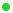

# App Dashboard

## App Dashboard

A dashboard is Reasy's home page, where you manage, create, and browse all of your apps. It displays the app statuses using colored tags, with each color denoting a different status.

 **Active**; means the app is live and is available to use\
 **Inactive;** means the app is still in development and has yet to go live\
 **Checked-out**; means it’s an app’s new version

The "Sorting" option on the Dashboard lets you filter your apps for a better viewing experience. Another intriguing feature is that when you no longer require an app, you may safely delete it, and restore it from the App Store when you do.&#x20;

All these features let you personalize your dashboard based on your requirements and preferences. To learn more about dashboard features and app management, [visit this page](app-management.md).
