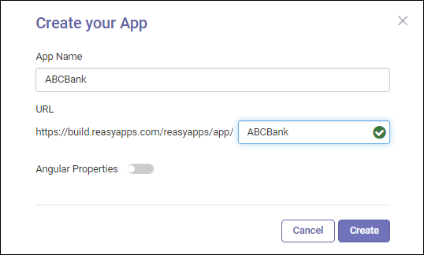

---
layout:
  title:
    visible: true
  description:
    visible: false
  tableOfContents:
    visible: true
  outline:
    visible: true
  pagination:
    visible: true
---

# Create Your First App

App creation is a two-step process.&#x20;

* Click and select **Create.**
* Name your app and enter a unique endpoint URL to access it.

<figure><figcaption></figcaption></figure>


By default, the endpoint URL is presented alongside the app name. However, it's your choice to use it or change to a custom URL. Make sure of your app URL, as you can't change it after creating the app.


As you create an app, it opens up in the workspace for you to build. However, the **Apps** menu in the workspace brings you back to the app dashboard, where you can see your created app.

The created app will be "Inactive" by default, up until you activate it.
