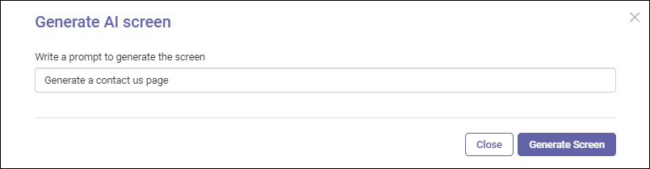

---
layout:
  title:
    visible: true
  description:
    visible: false
  tableOfContents:
    visible: true
  outline:
    visible: true
  pagination:
    visible: true
---

# Text to Screen

"Text to Screen" is an innovative and efficient solution that leverages the capabilities of Chat GPT to generate HTML screens based on prompts provided by users. With this feature, you can easily create dynamic and interactive web pages by simply describing your requirements in natural language.

To generate a screen using text,

Input a prompt (textual description) of the HTML screen you want to create.

<figure><figcaption></figcaption></figure>

The platform generates a "Contact Us" screen and is available in Navigation Explorer. Open it and make the necessary changes to it as required for your app.
