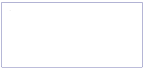

---
layout:
  title:
    visible: true
  description:
    visible: false
  tableOfContents:
    visible: true
  outline:
    visible: true
  pagination:
    visible: true
---

# Cards

A card component, resembling a physical card, is a versatile and stylish way to display information within a contained and visually appealing container. You can put in a wide range of content types, including text, images, and interactive elements such as links and buttons within a card. With a little creativity, you can use it in a variety of ways to enhance your website's design and functionality.

Include card components in your app design to:

* Provide a clear visual hierarchy, making it easy for users to distinguish different sections or pieces of information.
* Organize content, allowing developers to present information in a digestible format.
* Focus on key information.
* Serve as clickable elements, allowing users to navigate to different sections or perform actions directly from the cards.
* Make the app interface more engaging and interactive, and many more.

It's a great alternative to plain text blocks because it allows for easy organization and adds a touch of style to your application. But how do you use it? It's simple. Drag the appropriate card type and customize it to your liking; you can choose the size, shape, and background color.

Reasy includes a library of ready-to-use cards that can be dragged onto the canvas, eliminating the need to create any card type from scratch. Each one serves specific purposes, catering to various types of content or functionalities.&#x20;

Let's go over each card type:

### Card Metric

The card metric component in Reasy works like an analytical dashboard, with a summary shown at the top in the form of card snippets. You can customize every single part of it.

<figure><figcaption></figcaption></figure>

**Use cases**

Ideal for dashboards or analytics panels where key metrics need to be highlighted and to showcase essential figures like sales, website traffic, or any measurable data points.

### Card Profile

A card profile typically includes a profile picture or icon, the entity's name or title, a brief description, or other relevant information. Card profiles provide a visually appealing, easy-to-read summary of an entity's information.

<figure><figcaption></figcaption></figure>

#### Use cases

It is often used in social media, employee directories, and user profiles, including name, image, role, and other key information.

### Card Form

A card form is a confined space that houses form elements for capturing user input or allowing quick data entry without leaving the main interface. You can customize it by adding more form components to it.

<figure><figcaption></figcaption></figure>

#### Use cases

This card type is commonly found on registration pages, contact forms, and any data entry interface.

### Card Widget

This card widget is a set of cards that you can directly drag and use in your app interfaces where you need a set of cards to display essential information, such as dashboard summaries or mobile app home screens.&#x20;

<figure><figcaption></figcaption></figure>

#### Use cases

Several use cases for the card widget include news feeds, dashboard summaries, weather forecasts, portfolio pieces, and many more to list.

### Card Progress Bar

This card component uses a visual bar format to illustrate progress toward a goal or completion status more engagingly.

<figure><figcaption></figcaption></figure>

#### Use cases

The common use cases of this card component include project tracking, loading content, poll/vote results, disk space management, and more.

### Card Progress Circle

This is similar to a progress bar, but it is displayed in a circular format within the card. It is appropriate for displaying completion percentages, milestones, or countdowns in a more visually appealing manner.

<figure><figcaption></figcaption></figure>

#### Use cases

While the specific progress display may differ across applications, prominent use cases include tracking projects, fitness goals, mobile data usage, preloaders, and more.&#x20;

### Card User Info

A card that displays comprehensive user-related details, including bio, user photo, contact info, social media links, and preferences, for a more in-depth understanding of a user's profile.

<figure><figcaption></figcaption></figure>

#### Use cases

Ideal use cases include social media platforms, contact directories, user account pages, and in systems requiring deeper user insights, like admin panels or CRM tools.

### Card Task

A card that is best suited to highlight specific tasks, to-dos, or action items compactly, typically including task name, status, priority, and due date.

<figure><figcaption></figcaption></figure>

#### Use cases

It is often used in project management tools, task boards, or scheduling apps.

### Card Product

This card component helps in exhibiting product information, including images, descriptions, prices, reviews, and purchase options in a concise format, as well as an actionable item such as "Add to cart." or "Check out".

<figure><figcaption></figcaption></figure>

#### Use cases

This card type is commonly used in e-commerce platforms, hotels, or product catalog displays.

### Card User

This is similar to Card Profile but focuses specifically on user-specific functionalities, interactions, or settings. This offers a condensed view of user-specific information, often containing basic details like name, role, image, and contact info for quick reference.

<figure><figcaption></figcaption></figure>

#### Use cases

Although the ideal use cases vary depending on the app-specific requirements, it is frequently seen in user settings, preferences panels, or account management sections.&#x20;

### Card Info

This card component presents snippets of information or news headlines. It is used to display information, such as an icon or image representing the type of information, a short description, and CTA buttons like Learn More, Apply Now, and others.

<figure><figcaption></figcaption></figure>

#### Use cases

Ideal for content-rich apps, news feeds, or informational displays.

### Card Upload

This card component allows users to select and upload files, gving it a name and description.

<figure><figcaption></figcaption></figure>

#### Use cases

Utilized in file-sharing platforms, image galleries, or content management systems.

### Card

This is a plain card with a simple and clean layout. Plain cards are versatile and adaptable, fitting a wide range of content types and contexts. They are a design choice for emphasizing simplicity and clarity when presenting information.

<figure><figcaption></figcaption></figure>

#### Use cases

Plain cards find usage in various contexts where a clean and uncluttered layout is preferred, such as displaying text-based content, notifications, or essential data points.
