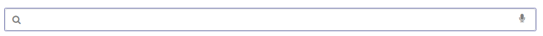
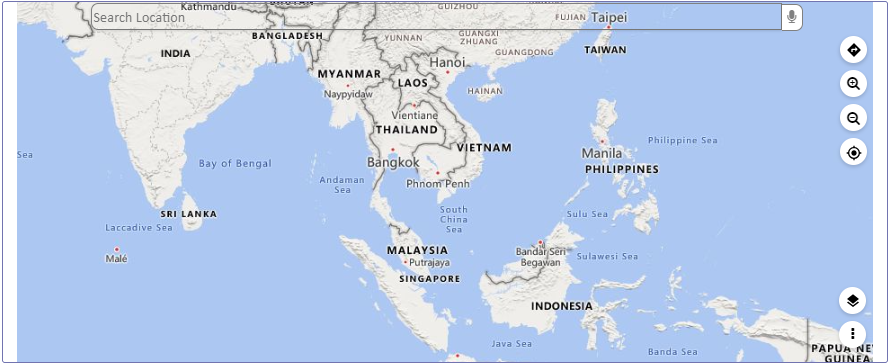
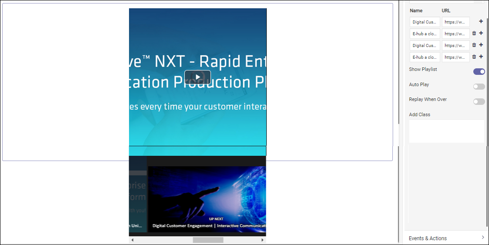
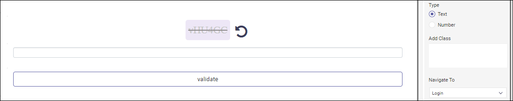
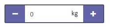
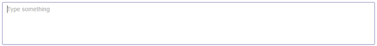
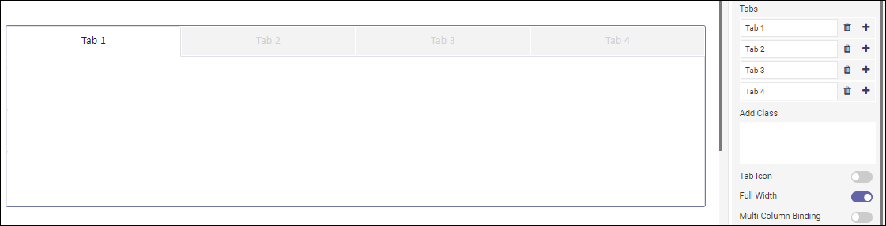
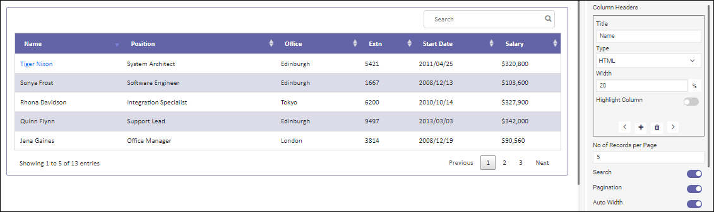
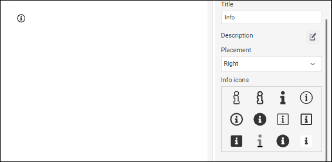

---
layout:
  title:
    visible: true
  description:
    visible: false
  tableOfContents:
    visible: true
  outline:
    visible: true
  pagination:
    visible: true
---

# Custom Components

Considering a variety of business scenarios, Reasy offers a range of draggable tools like the barcode, webcam, chatbot, and others under the "Custom" category. You can drag them and customize their behavior and appearance as needed.

Let's go over each of these components.

### Webcam

The Webcam component lets users capture photos or enable live interactions using their device's camera within the app. It is a handy tool for seeing things in real time.

#### Use cases

This component is best used for remote interviews, virtual workshops, or user identification processes.

### Doc Viewer

The Doc Viewer lets you easily view different document formats in the app. You do not need external tools to preview documents. You can do more than just viewing. You can search, highlight content, and switch to presentation mode for a better view. You can enable rotation and annotations to offer your users a more convenient way.

<figure><figcaption></figcaption></figure>

#### Use cases

It is ideal for reading PDFs, Word docs, and more directly within the app. Useful for applications involving document viewing, like document management systems or collaborative platforms.

### Search

The Search component empowers users to quickly locate specific information within the app. As this is a voice-enabled search, users can search either by text or by voice. It streamlines content discovery for enhanced user experience.

<figure><figcaption></figcaption></figure>

#### Use cases

Essential for applications with large datasets or content-rich platforms where users need to find specific information rapidly.

### Progress Bar

The Progress Bar shows you how much of a task is done with a bar that fills up as you make progress. It shows users their status and motivates them to finish. Use this component when the process can be described with quantitative information, such as a percentage.

<figure><figcaption></figcaption></figure>

#### Use cases

It is also frequently used to demonstrate the progress of file uploads, course completions, and system operations such as downloading, uploading, loading data, submitting a form, or saving updates.

### Progress Circle

The Progress Circle component represents progress in a circular format. It offers an alternative visual style to showcase completion. Use this for goal trackers to elegantly display achievement levels.

<figure><figcaption></figcaption></figure>

#### Use cases

Its use cases include tracking projects, fitness goals, mobile data usage, preloaders, and more.

### Progress Wizard

Guide users through multi-step processes with the Progress Wizard component. Break down complex tasks into manageable steps for a structured user journey. It helps users see exactly where they are and what’s next.

<figure><figcaption></figcaption></figure>

#### Use cases

Perfect for complex form submissions, onboarding sequences, and multi-step workflows, ensuring users navigate through tasks systematically.

### Maps

Integrate interactive maps seamlessly using the Maps component. Display locations, routes, or geographical data, providing users with an engaging and informative experience.

<figure><figcaption></figcaption></figure>

#### Use cases

Ideal for location-based services, delivery tracking, or event planning, and for the applications requiring geographical visualization.

### OTP Generator

The OTP Generator helps ensure secure user transactions. You can customize the type, length, and countdown time for Resend OTP.

<figure><figcaption></figcaption></figure>

#### Use cases

This component is essential for banking apps and other secure applications. It ensures a robust and reliable verification process.

### Video

The video component helps you embed videos directly into your app. Users can enjoy multimedia content without leaving the app, fostering an immersive experience. You can also make a playlist with a bunch of videos and decide if you want autoplay on or off.

<figure><figcaption></figcaption></figure>

#### Use cases

This component is great for apps with video tutorials, entertainment content, educational platforms with video-based learning, and product showcases in e-commerce.

### Star Rating

Allow users to give feedback using the Star Rating feature. Users can rate content or services easily with a simple visual rating system. You can show the average rating along with the user rating and star count.

<figure><figcaption></figcaption></figure>

**Use Cases**

This is often used in reviews, product feedback, or any scenario where user ratings are valuable.

### Captcha

Adding Captcha will improve security. It checks if you are a real person and keeps your app safe from spam or bots. You can choose to use a captcha in text or numeric formats and decide where your users should go after they pass the verification.&#x20;

<figure><figcaption></figcaption></figure>

#### Use cases

It is often used for sign-ups or form submissions to maintain the site’s integrity.

### Kendo Tree

The Kendo Tree component can effectively organize and display hierarchical data. It offers a simple way to represent data with parent-child relationships in a tree-like structure for easy navigation.

<figure><figcaption></figcaption></figure>

#### Use cases

Its common use cases include navigation menus for web apps, file explorers, and organizational charts, among other things. It works best for displaying nested data.

### Facebook Sign-in/Twitter Sign-in/LinkedIn Sign-in/Google Sign-in/GitHub Sign-in

These components help users authenticate through social platforms. This lets them sign into your app using their social media accounts. You can use these social sign-ins to authenticate faster.

* Add Facebook Sign-in if you want to make access easier while still using social connectivity.
* For platforms that want to reach more people or start community discussions, use Twitter Sign-in.
* Add LinkedIn Sign-in to let users use their professional profiles to connect with new contacts or apply for jobs.
* For developer-centric platforms, add GitHub Sign-in, to make it easier for users to join developer-focused platforms and get involved in the community.
* Add Google Sign-In for a seamless login experience. It's a quick authentication process and a great way to make signing in easy for users.

<figure><figcaption></figcaption></figure>

### Timer

Use the Timer component to count down or track time. Display time duration or intervals for users engaging in time-sensitive activities. You can choose the type of timer, set the countdown time, and customize its appearance.

<figure><figcaption></figcaption></figure>

#### Use cases

This component is great for applications featuring countdowns, reminders, limited-time deals in e-commerce sites, or any scenario where you need to keep track of time.

### Weather Widget

Keep users informed on the weather with the Weather Widget component. It provides real-time weather forecasts, or climatic details, either for the current day or for the next 5 days.

<figure><figcaption></figcaption></figure>

#### Use cases

It is often used in travel apps or event planning platforms. Ideal for applications requiring weather updates, travel planning, or location-based services.

### Mobile Number

The Mobile Number field is essential for communication-based services or verification processes.

<figure><figcaption></figcaption></figure>

#### Use cases

It is useful in applications requiring user contact details, mobile number verification, or any scenario involving phone number input.

### Text Editor

The Text Editor component empowers users to input and format text seamlessly within the app. It is a rich text editor with a range of editing functionalities such as bold, italic, underline, bullet points, and numbered lists. It offers a user-friendly interface that facilitates text manipulation, formatting, and customization, resembling familiar word processing software.

<figure><figcaption></figcaption></figure>

**Use Cases**

Essential for applications involving content creation, document editing, note-taking, or any scenario requiring text input.

### Quantity

The Quantity component is a key tool in applications where your users need to input numbers or select quantities. It makes entering numeric data easier. Users can select values by simply increasing the number.

#### Use cases

It's commonly used in e-commerce checkouts, ordering systems, and other processes that involve working with quantities.

### Score Meter

The Score Meter is an excellent tool for showing numerical scores or ratings in a user-friendly format. It makes gamified experiences better by giving users an easy way to see and understand scores, making data interpretation simple. You can customize it to match different score ranges or styles.

<figure><figcaption></figcaption></figure>

#### Use cases

It is excellent for gaming platforms, educational apps, fitness apps, and more.

### Paragraph

The Paragraph component is a versatile tool for displaying text in different sections of the app's interface. It helps organize and present text in a structured way.

<figure><figcaption></figcaption></figure>

#### Use cases

It is commonly used to show information. You can use it to display error messages or alerts, create content snippets, explain form fields, and more.

### Step Wizard

The Step Wizard component is great for breaking down complex tasks into easy-to-follow steps. It helps users easily navigate through the task, allowing them to move back and forth. You can alter its orientation, position, and number of steps, as needed.

<figure><figcaption></figcaption></figure>

#### Use cases

It is commonly used in installations, onboarding, form submissions, banking apps, e-commerce checkouts, and more.

### Tabs

The Tabs component lets you easily organize and segment your content with multiple tab options. Tabs represent different sections, making it easy for users to switch between content sets. It has clear visual indicators for active tabs, making navigation easy. You can customize it as needed.

<figure><figcaption></figcaption></figure>

#### Use cases

Tabs are commonly used in apps for multi-step processes. You could try using this component to better organize your content in a small space.

### Table

The Table component helps you organize and display data systematically in rows and columns, enhancing data visualization and analysis. It allows customization of columns, rows, and cell formatting to suit specific data representation needs.

<figure><figcaption></figcaption></figure>

#### Use cases

This is essential for handling large volumes of data like inventory management systems, employee information, or any application that relies on structured data representation.

### Info

Use the Info component to quickly share important information in your app. It is ideal for alert messages or helpful hints that will not distract users. You can choose to replace an icon and change its style and position.

<figure><figcaption></figcaption></figure>

#### Use cases

It is commonly used in forms to explain fields, contextual information, instructional prompts to guide users through specific actions or steps, and more.

### Section Divider

The Section Divider is a versatile UI component designed to organize and categorize content within your application. It creates a visual break, making it easier for users to distinguish between different sections of information.

<figure><figcaption></figcaption></figure>

#### Use cases

It is often used in Single-page applications (SPAs), analytical dashboards, e-commerce platforms, and others.

### Numeric pad

The Numeric Pad UI component is like a virtual keypad in your app that lets you quickly enter numbers. It's just like typing them on a keyboard. It makes entering numbers a breeze.

<figure><figcaption></figcaption></figure>

#### Use cases

Ideal for financial platforms or any application that requires frequent numeric input.

You can even create a custom screen component. To learn how, [click here](../custom-screen-components.md), and follow the procedure.
