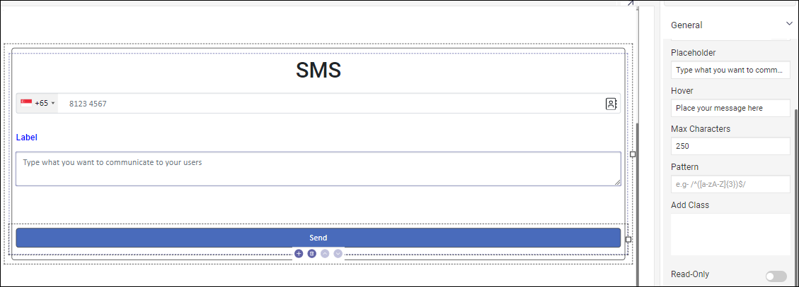

---
layout:
  title:
    visible: true
  description:
    visible: false
  tableOfContents:
    visible: true
  outline:
    visible: true
  pagination:
    visible: true
---

# Files & Images

This category has tools for files and images that are ready to use. These components help manage, display, and interact with files and images in an app's interface. They are best suited to handle multimedia content. You can upload, view, edit, and interact with files and images smoothly.

Reasy offers the following files and images:

### Logo

The "Logo" component allows you to effortlessly add your brand's logo or identifiers into your app. Your logo is the face of your company. Including a logo in your app is simple. Drag the component onto the canvas to use as a placeholder. Select your logo by clicking the Edit icon in the placeholder.

#### Use cases

It's often used

* for branding - to display the logo across the app for brand consistency.
* in navigation bars - to signify the home or main page.
* in headers or footers for easy recognition.

### Profile Picture

The Profile Picture component lets users upload and personalize their accounts. Adding a profile picture is simple. Drag it onto the canvas and a placeholder will appear. Add an image of yourself or an avatar by simply clicking on it to upload or capture your picture.

#### Use cases

Ideal for applications requiring user profiles, fostering a sense of identity, social connections, and others.&#x20;

### Icon Library

Simplify the design process with our Icon Library. The Icon Library has a collection of icons for different app features and actions. You can choose the ones you prefer to enhance your app's visual language while conserving space. Adding icons is easy. When you drag the component, it will show a placeholder and ask you to choose an icon and color. You can even upload an icon of your choice in SVG format.

#### Use cases

Icons are often employed in menus and navigation bars for intuitive user guidance. They are useful in scenarios where you want to incorporate standardized icons for improved visual communication and navigation.

### Image Slider

The Image Slider component allows you to display a series of images one after another. You have the option to display it as a gallery or a slideshow. You can also specify the duration if each slide and include an animation that fits well with your app.

<figure><figcaption></figcaption></figure>

#### Use cases

Perfect for home pages or feature sections where a rotating display of images can capture users' attention.

### SMS

Make SMS integration seamless. The SMS component lets you send text messages from your app, so you can easily communicate with users. You can specify the character limit and patterns if needed. You can customize its appearance and behavior using its properties.&#x20;

<figure><figcaption></figcaption></figure>

**Use Cases**

Ideal for apps that need SMS notifications, verifications, or text-based user communication.

### File Upload

The File Upload component allows your users to upload content of their own. This facilitates users to either select the desired file(s) to upload or drag and drop selected files directly into a drop zone area to upload. It allows your users to easily upload documents, images, or any digital files. Drag this component onto the canvas and customize its behavior by setting its properties, wherein you can

* insert a placeholder,
* restrict the file size,
* set the maximum no. of files to be uploaded,&#x20;
* define the accepted file types, and&#x20;
* set validation messages when files fail to meet these criteria.

<figure><figcaption></figcaption></figure>

#### Use cases

A file uploader is commonly found in forms but can also be used as a standalone element. This is often used in form submissions for attaching files or documents.

### Image Uploader

The Image Uploader lets users add their images to personalize content. The Image Uploader lets users upload images, making it easier for them to share and engage with visual content. It facilitates you to restrict file size and set an error message when something fails.

#### Use cases

It is widely used in social media platforms or forums where users can upload images.
