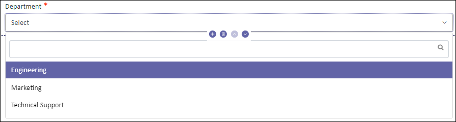
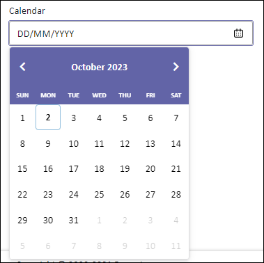
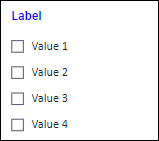
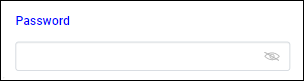
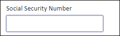

---
layout:
  title:
    visible: true
  description:
    visible: false
  tableOfContents:
    visible: true
  outline:
    visible: true
  pagination:
    visible: true
---

# Input Elements

Input elements represent typed data, usually with the control to edit them. These elements come with a default label and play a crucial role in Forms for capturing user input. These building blocks are essential when building robust apps.

Here's a walkthrough of each input element available in Reasy:

### **Textbox**

An input field allows you to enter and edit text or numeric data. Textboxes are versatile and can be found in a wide range of applications. Textboxes are your go-to choice for capturing single-line input, whether it's a name, address, phone number, or any other essential information.

.png>)

Use this to capture single-line input.&#x20;

#### Use cases

Some common use cases of Textboxes include:

* Form fields such as name, address, phone, email, and others
* Login screens to enter usernames and passwords
* Numeric input for values like prices, quantities, and others

### Text Area

The Text area is a multi-line input field for longer texts. You can, however, customize the character limit in its properties, to let users express themselves effortlessly. It comes with a label to name the field and, if required, make it mandatory.

<figure><figcaption></figcaption></figure>

Use it in your forms when you need to collect extensive information, such as feedback.

#### Use cases

This tool is often used in,

* Forms for collecting user inputs such as comments and reviews.
* Chat applications to compose and send messages.

### Dropdown

A dropdown, also known as a dropdown menu, presents a list of options when clicked. Further, you may customize it to allow your users to select multiple options, search, pagination, and more by configuring its properties. You may also configure it to display a message when none of the options are available. It comes with a label to name the field and, if required, make it mandatory.

As dropdowns become difficult when offering an overwhelming number of options, they are not recommended when you have too many or too few options.

<figure><figcaption></figcaption></figure>

Use it when your users must select single, multiple, or all options from a predefined list of options.

#### Use cases

Some common use cases include:

* Web forms with specific fields, such as country, state, occupation, or department,
* Filtering or sorting data based on various criteria, and
* Conditional Choices, where the options are dynamically populated based on previous selections, help users narrow down choices based on context.

### Calendar

A simple date picker that allows users to select a past, present, and future date. It includes properties to customize the date format and restrict past and future dates. Also, you can add time, including meridian (AM/PM). It comes with a label to name the field and, if required, make it mandatory.

<figure><figcaption></figcaption></figure>

Use this tool when your users must select a specific date.

#### Use cases

Use cases for the calendar include:

* Scheduling appointments and events,
* Collecting date of birth in forms,
* Booking travel tickets, whether for flights, trains, or buses.

### Calendar Range

This extension of a standard Calendar allows users to select a range of dates rather than just a single date. It includes two date pickers (calendars), one for the start ("from") date and another for the end ("to") date. It comes with a label to name the field and, if required, make it mandatory.

<figure><figcaption></figcaption></figure>

Use this form element when your users must select a range of dates.

#### Use cases

Some common use cases include:

* Bank statements for a specific period,
* Filtering data within a specified time range for generating insights,
* Hotel or travel reservations,
* Vacation or leave requests,
* Project timeframes, and more.

### Range Slider&#x20;

The range slider helps users select a range of values within a defined range by moving a slider along a track. Include a label that describes what the slider changes. It comes with a property to set the range and the increment value.

<figure><figcaption></figcaption></figure>

Use it when your users must select a range within a predetermined range of values.

#### Use cases

Some common use cases include:

* Property apps allow users to set a filter based on the budget that they are looking for.
* Product filters on e-commerce websites, and others.

### List Slider

The List Slider component combines the functionality of a list and a slider, allowing users to scroll through a collection of items horizontally. It helps users navigate easily through a set of content items or options.

<figure><figcaption></figcaption></figure>

#### Use cases

It is usually used in Image Galleries, Product Catalogs, News Feeds, Feature Selections, and others.

### Checkbox

The Chechbox is a selection control that lets users select options, toggle settings on and off, and so on. The checkbox element can be used in two ways:

1. One is to select or deselect one or more from a set (recommended for a limited number of choices).
2. The other way is a stand-alone checkbox, usually placed at the end of a form for users to agree to specific terms and conditions.

<figure><figcaption></figcaption></figure>

Checkboxes are often employed in forms to capture user preferences or gather information. Use checkboxes to allow users to select one or more options from a list or to turn an item on or off in a desktop environment.&#x20;

#### Use cases

Some everyday use cases include:

* Choosing items for a shopping cart,
* Selecting features on a page,
* Filtering and sorting options on e-commerce websites,
* Subscribing to a newsletter,
* Accepting Privacy Policy and Terms & Conditions, and many more.

### Radio Button

A Radio button is a selection control for choosing one option from a set of two or more mutually exclusive choices. It provides higher visibility and reduces cognitive load. It comes with a label to name the field and, if required, make it mandatory.&#x20;

Its properties let you decide to provide a default selection in cases where the user skips the selection, but it is essential. Also, you can choose to display options vertically or horizontally.

<figure><figcaption></figcaption></figure>

They are ideal when you want to present all options upfront and when you want users to select only one option at a time.

#### Use cases

A few use cases include:

* Form inputs such as titles (Mr./Miss/Mrs.), gender (Male/Female), and others.
* Polls to collect responses for single-choice questions, ensuring each respondent selects only one option.


**Hint**: While you can offer numerous options, it's advisable to keep the set of choices limited.


### Password

The password field is designed for securely capturing sensitive information like passwords or PIN codes. It includes a hide/show icon for masking or revealing passwords. By default, it is masked. Its properties allow you to define a pattern for the password.

<figure><figcaption></figcaption></figure>

Use it to securely capture sensitive information like passwords or PIN codes.

#### Use cases

Some everyday use cases include:

* Account passwords
* One-time password/PIN

### Pan card

This input field is for collecting users' PAN (Permanent Account Number) details. Despite being a simple textbox, Reasy simplifies this process by offering a dedicated PAN card component, ensuring accurate display and format.

<figure><figcaption></figcaption></figure>

Use it when you must collect users' PAN details.

#### Use cases

Some everyday use cases include:

* Income tax filings,
* Financial transactions such as opening bank accounts,
* Loan applications,
* Property transactions, and others.


**Note**: As it is significant in verifying users' identities and complying with legal and regulatory requirements, it is important to handle this sensitive information securely and ensure compliance with privacy and data protection regulations.


### Aadhaar Number

An input field to collect your users' 12-digit AADHAAR details. Despite being a simple textbox, Reasy provides a direct **Aadhaar Number** component to help you save time changing the label and the placeholder.

<figure><figcaption></figcaption></figure>

Use it when you must collect the user's identity.

#### Use cases

Some everyday use cases of Aadhaar include:

* KYC (Know Your Customer) verification in various sectors, including banking, telecom, and financial services
* Government services for accessing various government services and schemes
* Digital Identity during mobile SIM activation for identity verification and compliance with regulations
* Used for identity verification in insurance claims and healthcare services, ensuring accurate beneficiary identification.


**Note:** As it is significant in verifying users' identities and complying with legal and regulatory requirements, it is important to handle this sensitive information securely and ensure compliance with privacy and data protection regulations.


### SSN&#x20;

An input field to facilitate your users in the USA entering their SSN (Social Security Number) details. Even though you can collect this information with a simple textbox, the SSN component simplifies the process by helping your users enter their unique identity securely in a specific format, enabling you to record their information.

<figure><figcaption></figcaption></figure>

Use it when you must collect the identity proof of users located in the USA.

#### Use cases

Some use cases of SSN fields include:

* Employment Applications for background checks, payroll, and tax purposes,
* Financial services like account opening and loan applications,
* Credit applications,
* Legal documents such as contracts and agreements,
* Insurance and healthcare-related applications, and more.

### HTML Editor

The HTML Editor component makes it easy for your users to learn and try things out on their own. It provides an intuitive interface that simplifies the learning experience. The editor allows users to experiment with code. As they input the code, it shows a preview of how it will look.

<figure><figcaption></figcaption></figure>

#### Use cases

Including this component in your HTML learning app is a fantastic idea. This resource is great for beginners who are excited to start learning HTML.

### QR Code Generator

Easily create QR codes using the QR Code Generator component. QR codes are square patterns that you can scan to get information. They're really handy for quickly sharing data. You can use this tool to quickly generate QR codes, which makes it easy to share and store information.

<figure><figcaption></figcaption></figure>

#### Use cases

It is widely used in event invitations, product labelings, business cards, payment transactions, digital menus in restaurants, marketing collaterals, educational resources, and more.

### Barcode Generator

The Barcode Generator component makes it easier to generate barcodes, within the app. This component meets the industry standards and works with the scanners or systems you want to use. You can select the barcode type and content to display.

<figure><figcaption></figcaption></figure>

#### Use cases

It is often used in inventory management, asset tracking, retail and sales, membership and loyalty programs, healthcare, and more.

### Expiry Date

The Expiry Date component allows you to effortlessly incorporate an expiration date feature in your application. Simply drag and drop the Expiry Date component into your application form or interface. Configure it by setting the desired expiry date and customizing the display format.

<figure><figcaption></figcaption></figure>

#### Use cases

It is often used in subscription-based services, product inventories, password expiry, trial periods, health and safety compliance, and more.

