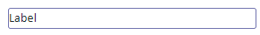

---
layout:
  title:
    visible: true
  description:
    visible: false
  tableOfContents:
    visible: true
  outline:
    visible: true
  pagination:
    visible: true
---

# Texts

### Heading 1, Heading 2, and Heading 3

Headings are text elements and are typically used to break down content into meaningful sections and guide users through the interface.&#x20;

Headings are categorized into different levels, often represented by hierarchical tags such as "h1," "h2," "h3," and so on. The number indicates the level of importance and hierarchy, with "h1" being the highest and most important level, followed by "h2," "h3," and so on.&#x20;

Reasy offers three levels of headings with distinct visual styles, such as font size and weight, for each level to help users differentiate between different sections. However, you can include more heading levels using code with associated CSS.

<figure><figcaption></figcaption></figure>

Here are some scenarios where headings are beneficial:

* Page titles,
* Section titles,
* Grouping content,
* Visualizations, and others.

### Label

A label is a descriptive text or visual element associated with a UI component, such as a form field, button, or menu option. It lets you add a clear and concise description of the purpose expected within the associated component. Labels are typically positioned adjacent to or within the component, ensuring users can easily understand and interact with the interface.

<figure><figcaption></figcaption></figure>

Use labels whenever you have an interactive UI element that requires user input or action. However, you don't have to worry about this with Reasy because most of the Form elements come with a label. Label any other visual elements, such as graphs, to describe what they are.

#### Use cases

* Form fields
* Navigations
* Error messages


**Note**: Remember that labels should be concise, meaningful, and relevant to the associated element.


### Marquee

A marquee is a dynamic web element that scrolls text or content horizontally or vertically across a certain section of a website. It's a visual effect that adds movement to static content, making it more appealing. Reasy offers you control over its behavior, such as scrolling, sliding, etc., and the direction.

Use it to highlight messages, announcements, headlines, or any other type of content that demands attention and visibility.

#### Use cases

Some everyday use cases include:

* Announcements,
* Special offers, discounts, or promotions that you want users to notice immediately,
* Event-related information, event countdown,
* Emergency alerts,
* Weather updates,
* Breaking news headlines, and such others.
